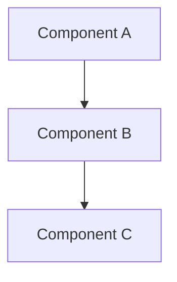

# Architecture Design: {{name}}

> Created: {{date}}

## Design Goals

<!-- Describe the core objectives of this architectural design -->

## System Scope

<!-- Define system/module boundaries affected by this change -->

- **Affected Systems**:
- **Affected Modules**:
- **Out of Scope**:

## Architecture Decisions

### Decision 1: [Decision Title]

**Context**: Why is this decision needed?

**Options Considered**:
- **Option A**: [Description]
  - Pros:
  - Cons:
- **Option B**: [Description]
  - Pros:
  - Cons:

**Decision**: [Chosen option]

**Rationale**: [Why this option was chosen]

### Decision 2: [Decision Title]

**Context**:

**Options Considered**:
- **Option A**:
- **Option B**:

**Decision**:

**Rationale**:

## Architecture Diagram

<!-- Use mermaid or text to describe key architecture -->

## Data Flow

<!-- Describe critical data flow paths -->

1. User Request →
2. Processing Layer →
3. Storage Layer →
4. Response

## Technology Stack

<!-- If introducing new technologies, explain rationale -->

| Technology | Version | Purpose | Rationale |
|------------|---------|---------|-----------|
| |  |  |  |

## Performance Impact

- **Expected Performance Changes**:
- **Potential Bottlenecks**:
- **Optimization Strategies**:

## Security Considerations

- **Authentication**:
- **Authorization**:
- **Data Encryption**:
- **Audit Logging**:

## Scalability Considerations

- **Horizontal Scaling**:
- **Vertical Scaling**:
- **Future Evolution Path**:

## Migration Strategy

<!-- If major architectural changes, describe migration steps -->

1. **Phase 1**:
2. **Phase 2**:
3. **Phase 3**:

**Rollback Plan**:

## Risks & Mitigation

| Risk | Impact | Probability | Mitigation |
|------|--------|-------------|------------|
| | | | |

## Dependencies

<!-- Dependencies of this architectural design -->

- **Dependent Changes**:
- **External System Dependencies**:
- **Dependents**:

---

**Status**: 🟡 Draft
