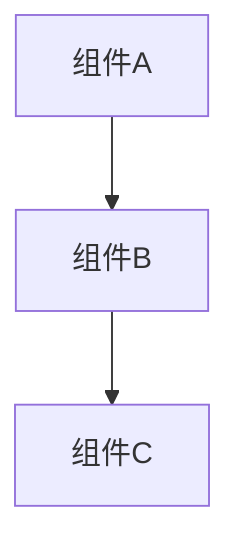

# 架构设计: {{name}}

> 创建日期: {{date}}

## 设计目标

<!-- 描述本次架构设计要达成的核心目标 -->

## 系统范围

<!-- 说明本次变更涉及的系统/模块边界 -->

- **影响的系统**:
- **影响的模块**:
- **不涉及的范围**:

## 架构决策

### 决策 1: [决策标题]

**上下文**: 为什么需要这个决策?

**可选方案**:
- **方案 A**: [描述]
  - 优点:
  - 缺点:
- **方案 B**: [描述]
  - 优点:
  - 缺点:

**最终选择**: [选择的方案]

**理由**: [为什么选择这个方案]

### 决策 2: [决策标题]

**上下文**:

**可选方案**:
- **方案 A**:
- **方案 B**:

**最终选择**:

**理由**:

## 架构图

<!-- 使用 mermaid 或文本描述关键架构 -->

## 数据流

<!-- 描述关键数据流转路径 -->

1. 用户请求 →
2. 处理层 →
3. 存储层 →
4. 响应

## 技术栈选型

<!-- 如引入新技术栈,说明选择理由 -->

| 技术 | 版本 | 用途 | 选择理由 |
|------|------|------|---------|
| |  |  |  |

## 性能影响

- **预期性能变化**:
- **潜在瓶颈**:
- **优化策略**:

## 安全考量

- **身份认证**:
- **权限控制**:
- **数据加密**:
- **审计日志**:

## 扩展性考虑

- **水平扩展能力**:
- **垂直扩展能力**:
- **未来演进路径**:

## 迁移策略

<!-- 如涉及重大架构变更,描述迁移步骤 -->

1. **阶段 1**:
2. **阶段 2**:
3. **阶段 3**:

**回滚方案**:

## 风险与缓解

| 风险 | 影响 | 概率 | 缓解措施 |
|------|------|------|---------|
| | | | |

## 依赖关系

<!-- 本架构设计依赖的其他变更或系统 -->

- **依赖的变更**:
- **依赖的外部系统**:
- **被依赖方**:

---

**状态**: 🟡 草稿
